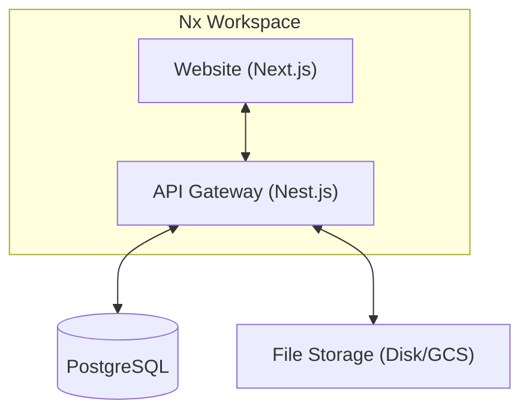

# SSKRU Management System

ระบบบริหารจัดการทรัพยากรและหลักสูตร (SSKRU) พัฒนาด้วยสถาปัตยกรรม **Monorepo** เพื่อรองรับความยืดหยุ่นและการขยายตัวของระบบในอนาคต

---

## 🏗️ สถาปัตยกรรมระบบ (System Architecture)

ระบบถูกออกแบบโดยใช้แนวคิด **Monorepo** ผ่าน **Nx Workspace** ซึ่งแยกส่วนการทำงานออกเป็น Application และ Library



### Tech Stack

- **Frontend**: Next.js 14, Mantine UI v6, Axios, React Hook Form
- **Backend**: NestJS, Drizzle ORM, Passport JWT, Argon2 (Hashing)
- **Database**: PostgreSQL
- **DevOps**: Nx, Docker, GitHub Actions, GitHub Container Registry (GHCR)

---

## 📁 โครงสร้างโปรเจค (Project Structure)

```text
sskru-main/
├── apps/
│   ├── website/          # Frontend Application (Next.js)
│   │   ├── src/
│   │   │   ├── auth/     # ระบบ Authentication & Guards
│   │   │   ├── layout/   # จัดการ Layout กลาง
│   │   │   ├── sections/ # ส่วนของ UI แยกตาม Module
│   │   │   └── routes/   # จัดการเส้นทางและ Paths
│   └── api-gateway/      # Backend API (Nest.js)
│       ├── src/
    │   ├── common/   # Drizzle Schema, Errors, Storage Infrastructure
    │   ├── listeners/# Event Listeners (Domain-specific listeners shifted to modules)
    │   ├── modules/  # ก้อนธุรกิจหลัก (Self-contained Modules)
    │   │   ├── auth/         # Auth Rest & Identity Services
    │   │   ├── personnel/    # Personnel Services & DTO
    │   │   ├── curriculum/   # Curriculum Services & Repository
    │   │   ├── storage/      # File Storage Controller & Module
    │   │   └── ...
    │   └── app.ts    # Root Module (Direct injection of domain modules)
├── libs/                 # Shared libraries (ถ้ามี)
└── docker-compose.yml    # สำหรับรัน Infrastructure ท้องถิ่น
```

---

## 🔒 การออกแบบระบบความปลอดภัย (Security & Design)

### Authentication Flow (Local JWT)

ระบบใช้ **JSON Web Token (JWT)** ในการยืนยันตัวตนแบบ Local (ยกเลิกการใช้ Firebase)

1. ผู้ใช้ Login ผ่าน `JwtLoginView`
2. Backend ตรวจสอบข้อมูลในตาราง `identities` ผ่าน `IdentityService`
3. หากถูกต้อง จะได้รับ JWT Token ที่เก็บข้อมูล Identity, Roles และ `systemUrls`
4. Frontend เก็บ Token ไว้ใน `localStorage` และใช้ Axios Interceptor ส่งไปกับทุก Request

### Role-Based Access Control (RBAC)

ระบบออกแบบการเข้าถึงข้อมูลแบบลำดับชั้น (identities -> roles -> permissions -> systems)

- **ProtectURLGuard**: ตรวจสอบสิทธิ์การเข้าถึงหน้าตาม `systemUrls` ของผู้ใช้
- **AuthGuard**: กรองหน้าจอตามสถานะการเข้าสู่ระบบและบทบาท (Admin, Personnel, Student)

### Thai Localization

UI ทั้งหมดถูกปรับเปลี่ยนเป็น **ภาษาไทย** 100% เพื่อให้เหมาะสมกับผู้ใช้งานชาวไทย โดยมีการแยก Section UI และ Layout labels ให้รองรับภาษาไทยในระดับโค้ด

---

## 🚀 การเริ่มใช้งาน (Quick Start)

### 1. ติดตั้ง Dependencies

```bash
pnpm install
```

### 2. ตั้งค่า Environment

สร้างไฟล์ `.env` ใน `apps/website` และ `apps/api-gateway` โดยอ้างอิงจาก `.env.example`

### 3. เตรียมฐานข้อมูล (PostgreSQL)

```bash
docker compose up db -d
```

### 4. จัดการ Database Schema

```bash
# สร้าง Schema
pnpm exec nx run api-gateway:db:generate
# รัน Migration
pnpm exec nx run api-gateway:db:migrate
# เพิ่มข้อมูลตัวอย่าง (Mock Data)
pnpm exec nx run api-gateway:db:seed
```

### 5. รันเซิร์ฟเวอร์พัฒนา

```bash
# รัน Frontend (Website)
pnpm exec nx run website:dev

# รัน Backend (API Gateway)
pnpm exec nx run api-gateway:serve
```

---

## 🛠️ Nx Commands ที่สำคัญ

- `pnpm exec nx run-many -t build`: Build ทุกแอปพลิเคชัน
- `pnpm exec nx lint website`: ตรวจสอบ Code Quality ของ website
- `pnpm exec nx run api-gateway:db:seed`: รีเซ็ตข้อมูลในฐานข้อมูลเป็นค่าเริ่มต้น

---

## 📦 Deployment

ระบบใช้ **Docker** ในการ Packaging และ Deploy ผ่าน GitHub Actions ไปยัง environment ต่างๆ:

- **Staging**: ใช้ tag `v*.*.*-staging`
- **Production**: ใช้ tag `v*.*.*`

---

## 🤝 Contributing

โปรดปฏิบัติตามมาตรฐาน Code Formatting (Prettier/ESLint) และทำการ Merge ผ่าน Pull Request เท่านั้น
# sskru-runpee
